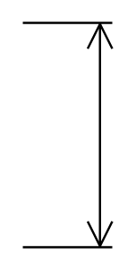

# Vertical Dimension

## Definition

```
{
  _style: 'shape=dimension;direction=north;whiteSpace=wrap;html=1;align=center;points=[];verticalAlign=bottom;labelBackgroundColor=none;horizontal=0;spacingBottom=3;',
  _width: 40,
  _height: 100,
}
```

## Usage

```
import { VerticalDimension } from '@diac/standard-components-diagrams/floorPlans'

<VerticalDimension/>
```

## Preview


