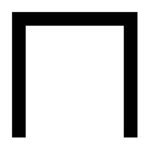

# Wall (U)

## Definition

```
{
  _style: 'verticalLabelPosition=bottom;html=1;verticalAlign=top;align=center;shape=mxgraph.floorplan.wallU;fillColor=strokeColor;',
  _width: 100,
  _height: 100,
}
```

## Usage

```
import { WallU } from '@reactiac/standard-components-diagrams/floorPlans'

<WallU/>
```

## Preview


