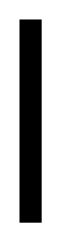

# Wall (Vertical)

## Definition

```
{
  _style: 'verticalLabelPosition=bottom;html=1;verticalAlign=top;align=center;shape=mxgraph.floorplan.wall;fillColor=strokeColor;direction=south;',
  _width: 10,
  _height: 100,
}
```

## Usage

```
import { WallVertical } from '@reactiac/standard-components-diagrams/floorPlans'

<WallVertical/>
```

## Preview


