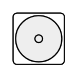

# Water Cooler

## Definition

```
{
  _style: 'verticalLabelPosition=bottom;html=1;verticalAlign=top;align=center;shape=mxgraph.floorplan.water_cooler;',
  _width: 40,
  _height: 40,
}
```

## Usage

```
import { WaterCooler } from '@diac/standard-components-diagrams/floorPlans'

<WaterCooler/>
```

## Preview


