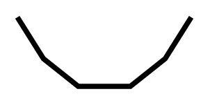

# Window, Bay

## Definition

```
{
  _style: 'verticalLabelPosition=bottom;html=1;verticalAlign=top;align=center;shape=mxgraph.floorplan.windowBay;strokeWidth=3;aspect=fixed;',
  _width: 100,
  _height: 40,
}
```

## Usage

```
import { WindowBay } from '@diac/standard-components-diagrams/floorPlans'

<WindowBay/>
```

## Preview


