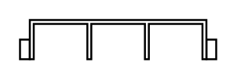

# Window, Garden

## Definition

```
{
  _style: 'verticalLabelPosition=bottom;html=1;verticalAlign=top;align=center;shape=mxgraph.floorplan.windowGarden;dx=0.25;',
  _width: 100,
  _height: 20,
}
```

## Usage

```
import { WindowGarden } from '@reactiac/standard-components-diagrams/floorPlans'

<WindowGarden/>
```

## Preview


