# Other Fluid Power (ISO 1219) Entities

- [X10010ControlMechanism](./x10010-control-mechanism.md)  
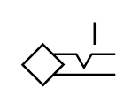

- [X10020PlungerWith](./x10020-plunger-with.md)  
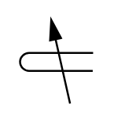

- [X10030PushPullControl](./x10030-push-pull-control.md)  

- [X10040ControlMechanism](./x10040-control-mechanism.md)  

- [X10050TurningControl](./x10050-turning-control.md)  

- [X10060RollerLever](./x10060-roller-lever.md)  

- [X10070ControlMechanism](./x10070-control-mechanism.md)  
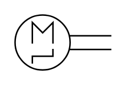

- [X10080PneumaticSpring](./x10080-pneumatic-spring.md)  
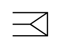

- [X10090PneumaticSpring](./x10090-pneumatic-spring.md)  

- [X10100PneumaticSpring](./x10100-pneumatic-spring.md)  

- [X10110SolenoidCoil](./x10110-solenoid-coil.md)  
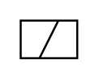

- [X10120SolenoidCoil](./x10120-solenoid-coil.md)  

- [X10130ElectricalControl](./x10130-electrical-control.md)  

- [X10140SolenoidCoil](./x10140-solenoid-coil.md)  
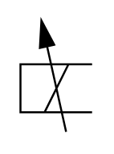

- [X10150SolenoidCoil](./x10150-solenoid-coil.md)  

- [X10160ElectricalControl](./x10160-electrical-control.md)  

- [X10170ElectricallyOperated](./x10170-electrically-operated.md)  

- [X10180ElectricallyOperated](./x10180-electrically-operated.md)  
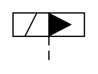

- [X10190MechanicalFeedback](./x10190-mechanical-feedback.md)  

- [X10200HydraulicControl](./x10200-hydraulic-control.md)  

- [X1021022TwoPort](./x10210-2-2-two-port.md)  

- [X1022022Directional](./x10220-2-2-directional.md)  

- [X1023042Directional](./x10230-4-2-directional.md)  

- [X10240PneumaticSoftStart](./x10240-pneumatic-soft-start.md)  
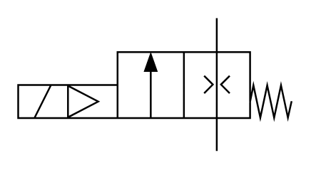

- [X10250PneumaticSlowStart](./x10250-pneumatic-slow-start.md)  

- [X1026032Lockout](./x10260-3-2-lockout.md)  

- [X1027032Directional](./x10270-3-2-directional.md)  

- [X1028032Directional](./x10280-3-2-directional.md)  
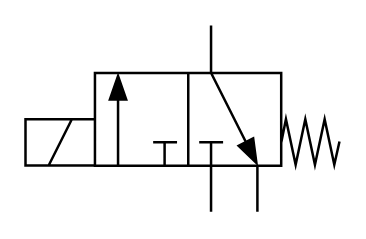

- [X1029032Directional](./x10290-3-2-directional.md)  

- [X10300PulseCounter](./x10300-pulse-counter.md)  

- [X1031032Directional](./x10310-3-2-directional.md)  

- [X1032042Directional](./x10320-4-2-directional.md)  

- [X1033042Directional](./x10330-4-2-directional.md)  

- [X1034032Directional](./x10340-3-2-directional.md)  

- [X1035042Directional](./x10350-4-2-directional.md)  

- [X1036043Directional](./x10360-4-3-directional.md)  

- [X1037043Directional](./x10370-4-3-directional.md)  

- [X1038042Directional](./x10380-4-2-directional.md)  

- [X1039043Directional](./x10390-4-3-directional.md)  
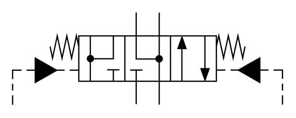

- [X1040052Directional](./x10400-5-2-directional.md)  

- [X1041052Pneumatic](./x10410-5-2-pneumatic.md)  

- [X1042053Directional](./x10420-5-3-directional.md)  
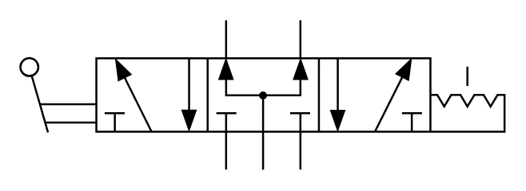

- [X1043052Pneumatic](./x10430-5-2-pneumatic.md)  

- [X1044052Pneumatic](./x10440-5-2-pneumatic.md)  
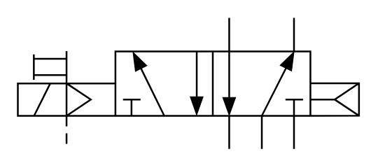

- [X1044152Pneumatic](./x10441-5-2-pneumatic.md)  

- [X1044252Pneumatic](./x10442-5-2-pneumatic.md)  
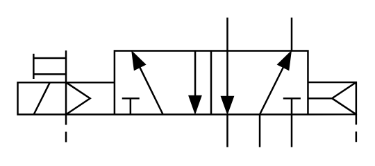

- [X1045053Pneumatic](./x10450-5-3-pneumatic.md)  

- [X10460DirectlyOperated](./x10460-directly-operated.md)  

- [X10470DirectlyOperated](./x10470-directly-operated.md)  

- [X1048032SolenoidActuated](./x10480-3-2-solenoid-actuated.md)  

- [X1049032SolenoidActuated](./x10490-3-2-solenoid-actuated.md)  

- [X10500DirectlyControlled](./x10500-directly-controlled.md)  

- [X10510SequenceValve](./x10510-sequence-valve.md)  

- [X10520SequenceValve](./x10520-sequence-valve.md)  

- [X10530SequenceValve](./x10530-sequence-valve.md)  

- [X10540PressureRegulator](./x10540-pressure-regulator.md)  

- [X10550DirectlyControlled](./x10550-directly-controlled.md)  

- [X10560PitotOperatedTwoPort](./x10560-pitot-operated-two-port.md)  

- [X10570PressureRegulator](./x10570-pressure-regulator.md)  

- [X10580PressureRelief](./x10580-pressure-relief.md)  

- [X10590AccumulatorChargingValve](./x10590-accumulator-charging-valve.md)  

- [X10600HydraulicPilotControlled](./x10600-hydraulic-pilot-controlled.md)  

- [X10610ThreePortPressureReducing](./x10610-three-port-pressure-reducing.md)  

- [X10620DualPressure](./x10620-dual-pressure.md)  

- [X10630FlowControlValve](./x10630-flow-control-valve.md)  
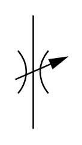

- [X10640FlowControlValve](./x10640-flow-control-valve.md)  

- [X10650FlowControlValve](./x10650-flow-control-valve.md)  
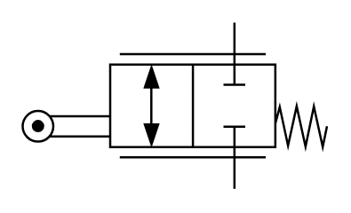

- [X10660TwoPortFlowControl](./x10660-two-port-flow-control.md)  

- [X10670ThreePortFlowControl](./x10670-three-port-flow-control.md)  

- [X10680FlowDivider](./x10680-flow-divider.md)  

- [X10690FlowCombiningValve](./x10690-flow-combining-valve.md)  

- [X10700NonReturnValve](./x10700-non-return-valve.md)  

- [X10710NonReturnValve](./x10710-non-return-valve.md)  
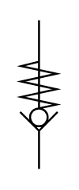

- [X10720PilotOperatedNonReturn](./x10720-pilot-operated-non-return.md)  

- [X10730DoubleNonReturn](./x10730-double-non-return.md)  

- [X10740ShuttleValve](./x10740-shuttle-valve.md)  

- [X10750QuickExhaustValve](./x10750-quick-exhaust-valve.md)  

- [X10760ProportionalDirectional](./x10760-proportional-directional.md)  
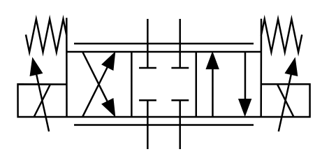

- [X10770ProportionalDirectional](./x10770-proportional-directional.md)  

- [X10780ProportionalDirectional](./x10780-proportional-directional.md)  

- [X10790ServoValvePilotOperated](./x10790-servo-valve-pilot-operated.md)  

- [X10800ServoValvePilotOperated](./x10800-servo-valve-pilot-operated.md)  
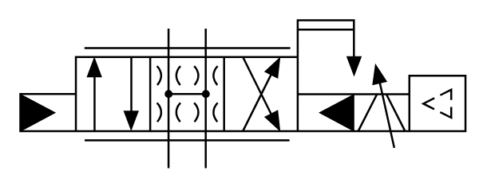

- [X10810ElectroHydraulicLinear](./x10810-electro-hydraulic-linear.md)  

- [X10820ServoValveWith](./x10820-servo-valve-with.md)  
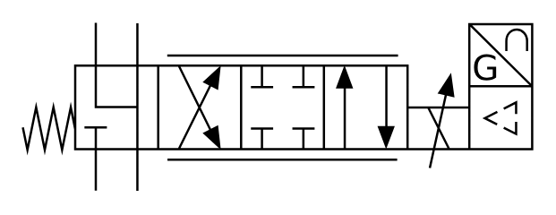

- [X10830ProportionalPressureRelief](./x10830-proportional-pressure-relief.md)  

- [X10840ProportionalPressureRelief](./x10840-proportional-pressure-relief.md)  

- [X10850ProportionalPressureRelief](./x10850-proportional-pressure-relief.md)  

- [X10860ProportionalPressureRelief](./x10860-proportional-pressure-relief.md)  

- [X10870ThreePortProportional](./x10870-three-port-proportional.md)  

- [X10880ProportionalPressureRelief](./x10880-proportional-pressure-relief.md)  

- [X10890ProportionalFlowControl](./x10890-proportional-flow-control.md)  
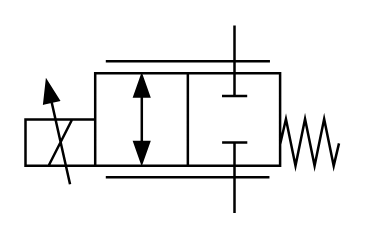

- [X10900ProportionalFlowControl](./x10900-proportional-flow-control.md)  
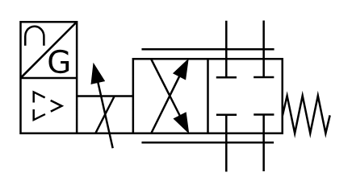

- [X10910ProportionalFlowControl](./x10910-proportional-flow-control.md)  
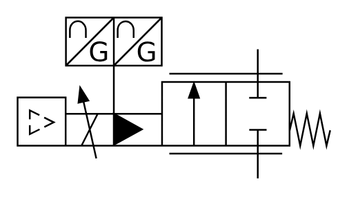

- [X10920AdjustableOrificeFlowControl](./x10920-adjustable-orifice-flow-control.md)  

- [X10930PressureControlAnd](./x10930-pressure-control-and.md)  
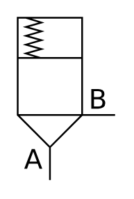

- [X10940PressureControlAnd](./x10940-pressure-control-and.md)  

- [X10950DirectionalControl](./x10950-directional-control.md)  

- [X10960DirectionalControl](./x10960-directional-control.md)  
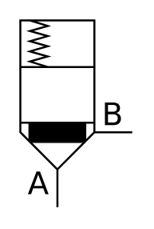

- [X10970DirectionalControl](./x10970-directional-control.md)  

- [X10980DirectionalControl](./x10980-directional-control.md)  

- [X10990ActiveControlDirectional](./x10990-active-control-directional.md)  

- [X11000ActiveControlDirectional](./x11000-active-control-directional.md)  
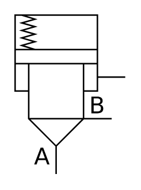

- [X11010DirectionalControl](./x11010-directional-control.md)  

- [X11020CartridgeFor](./x11020-cartridge-for.md)  

- [X11030PressureReducingValve](./x11030-pressure-reducing-valve.md)  

- [X11040PressureReducingValve](./x11040-pressure-reducing-valve.md)  

- [X11050ControlCover](./x11050-control-cover.md)  
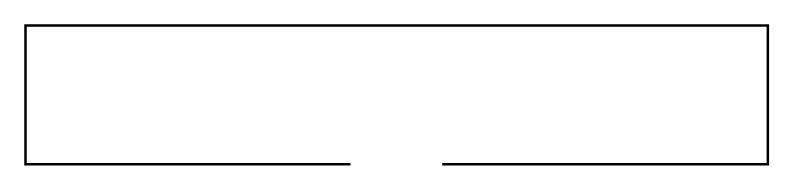

- [X11060ControlCover](./x11060-control-cover.md)  

- [X11070ControlCover](./x11070-control-cover.md)  

- [X11080ControlCover](./x11080-control-cover.md)  

- [X11090ControlCover](./x11090-control-cover.md)  
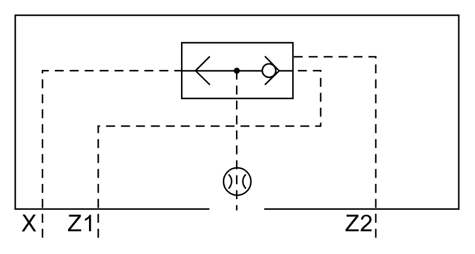

- [X11100ControlCover](./x11100-control-cover.md)  
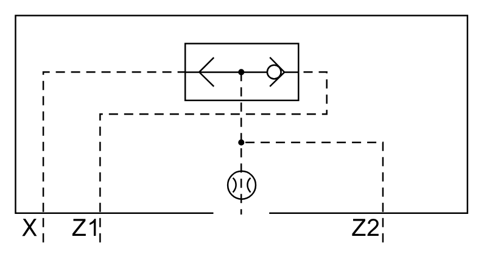

- [X11110ControlCover](./x11110-control-cover.md)  
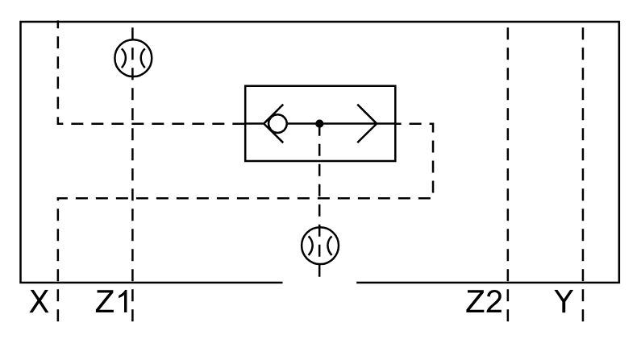

- [X11120ControlCover](./x11120-control-cover.md)  

- [X11130ControlCover](./x11130-control-cover.md)  

- [X11140ControlCover](./x11140-control-cover.md)  

- [X11150TwoPortCartridge](./x11150-two-port-cartridge.md)  

- [X11160TwoPortCartridge](./x11160-two-port-cartridge.md)  

- [X11170TwoPortCartridge](./x11170-two-port-cartridge.md)  

- [X11180TwoPortCartridge](./x11180-two-port-cartridge.md)  

- [X11190TwoPortCartridge](./x11190-two-port-cartridge.md)  

- [X11200TwoPortCartridge](./x11200-two-port-cartridge.md)  

- [X11210TwoPortCartridge](./x11210-two-port-cartridge.md)  

- [X11220TwoPortCartridge](./x11220-two-port-cartridge.md)  

- [X11230VariableDisplacementPump](./x11230-variable-displacement-pump.md)  

- [X11240VariableDisplacementPump](./x11240-variable-displacement-pump.md)  

- [X11250ReversiblePumpMotor](./x11250-reversible-pump-motor.md)  

- [X11260FixedDisplacement](./x11260-fixed-displacement.md)  

- [X11270PumpWith](./x11270-pump-with.md)  

- [X11280RotaryActuatorSwivel](./x11280-rotary-actuator-swivel.md)  

- [X11290SemiRotaryActuatorSwivel](./x11290-semi-rotary-actuator-swivel.md)  

- [X11300VariableDisplacementPump](./x11300-variable-displacement-pump.md)  

- [X11310VariableDisplacementPump](./x11310-variable-displacement-pump.md)  
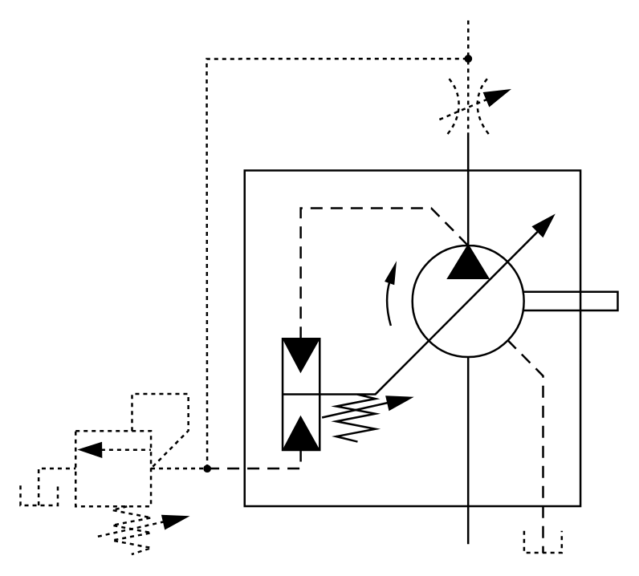

- [X11320VariableDisplacementPump](./x11320-variable-displacement-pump.md)  
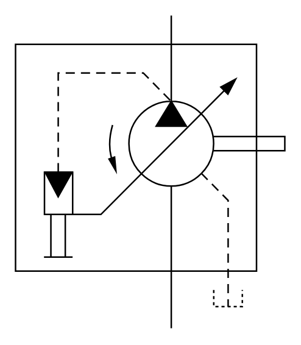

- [X11330VariableDisplacementHydraulic](./x11330-variable-displacement-hydraulic.md)  
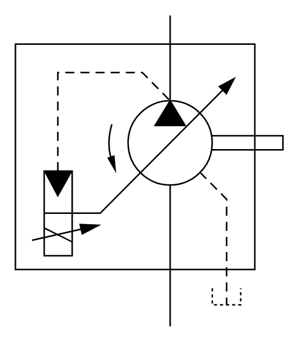

- [X11340VariableDisplacementPump](./x11340-variable-displacement-pump.md)  
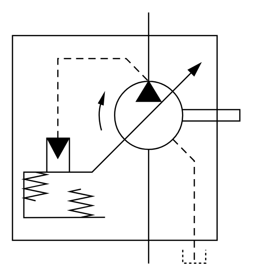

- [X11350VariableDisplacementPump](./x11350-variable-displacement-pump.md)  

- [X11360VariableDisplacementPump](./x11360-variable-displacement-pump.md)  

- [X11370HydrostaticTransmission](./x11370-hydrostatic-transmission.md)  

- [X11380VariableDisplacementPump](./x11380-variable-displacement-pump.md)  

- [X11390Motor](./x11390-motor.md)  
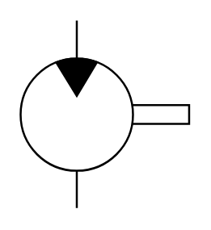

- [X11400Compressor](./x11400-compressor.md)  

- [X11410MotorWith](./x11410-motor-with.md)  

- [X11420VacuumPump](./x11420-vacuum-pump.md)  
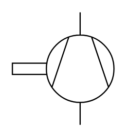

- [X11430PressureIntensifier](./x11430-pressure-intensifier.md)  
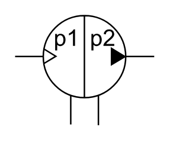

- [X11440SingleActingSingleRod](./x11440-single-acting-single-rod.md)  

- [X11450DoubleActingSingleRod](./x11450-double-acting-single-rod.md)  

- [X11460DoubleActingDoubleRod](./x11460-double-acting-double-rod.md)  

- [X11470DoubleActingDiaphragm](./x11470-double-acting-diaphragm.md)  

- [X11480SingleActingDiaphragm](./x11480-single-acting-diaphragm.md)  

- [X11490SingleActingCylinder](./x11490-single-acting-cylinder.md)  

- [X11500TelescopicCylinder](./x11500-telescopic-cylinder.md)  

- [X11510TelescopicCylinder](./x11510-telescopic-cylinder.md)  
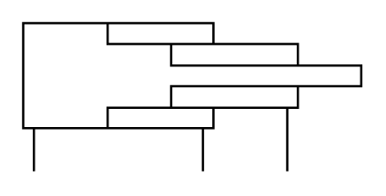

- [X11520DoubleActingBandType](./x11520-double-acting-band-type.md)  
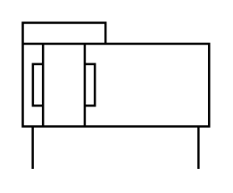

- [X11530DoubleActingCableType](./x11530-double-acting-cable-type.md)  

- [X11540DoubleActingMagneticType](./x11540-double-acting-magnetic-type.md)  

- [X11550DoubleActingCylinder](./x11550-double-acting-cylinder.md)  

- [X11560DoubleActingCylinder](./x11560-double-acting-cylinder.md)  

- [X11570PressureMediumConverter](./x11570-pressure-medium-converter.md)  
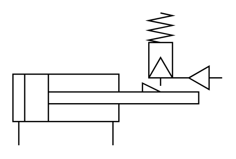

- [X11580PressureIntensifier](./x11580-pressure-intensifier.md)  

- [X11590PressureIntensifier](./x11590-pressure-intensifier.md)  

- [X11600BellowsCylinder](./x11600-bellows-cylinder.md)  
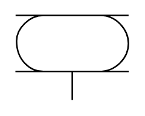

- [X11610HoseCylinder](./x11610-hose-cylinder.md)  
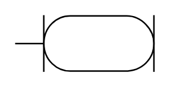

- [X11620SemiRotaryLinear](./x11620-semi-rotary-linear.md)  

- [X11630GripperDoubleActing](./x11630-gripper-double-acting.md)  
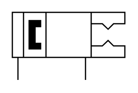

- [X11640GripperDoubleActing](./x11640-gripper-double-acting.md)  

- [X11650GripperSingleActing](./x11650-gripper-single-acting.md)  

- [X11660GripperSingleActing](./x11660-gripper-single-acting.md)  
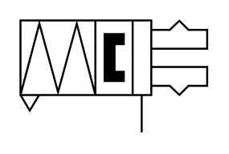

- [X11670HoseAssembly](./x11670-hose-assembly.md)  
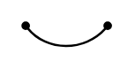

- [X11680ThreeWayRotary](./x11680-three-way-rotary.md)  

- [X11690QuickActionCoupling](./x11690-quick-action-coupling.md)  

- [X11700QuickActionCoupling](./x11700-quick-action-coupling.md)  

- [X11710QuickActionCoupling](./x11710-quick-action-coupling.md)  

- [X11720QuickActionCoupling](./x11720-quick-action-coupling.md)  
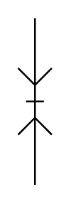

- [X11730QuickActionCoupling](./x11730-quick-action-coupling.md)  

- [X11740QuickActionCoupling](./x11740-quick-action-coupling.md)  
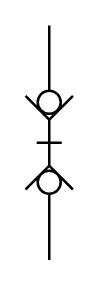

- [X11750PressureSwitch](./x11750-pressure-switch.md)  
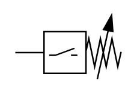

- [X11760PressureConverter](./x11760-pressure-converter.md)  

- [X11770PressureSensor](./x11770-pressure-sensor.md)  

- [X11780PiezoElectricControl](./x11780-piezo-electric-control.md)  

- [X11790OpticalIndicator](./x11790-optical-indicator.md)  

- [X11800IndicatorWith](./x11800-indicator-with.md)  
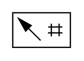

- [X11810AcousticIndicator](./x11810-acoustic-indicator.md)  

- [X11820PressureMeasuringUnit](./x11820-pressure-measuring-unit.md)  
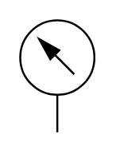

- [X11830DifferentialPressureGauge](./x11830-differential-pressure-gauge.md)  

- [X11840PressureGauge](./x11840-pressure-gauge.md)  
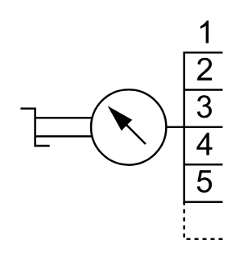

- [X11850Thermometer](./x11850-thermometer.md)  

- [X11860ThermometerWith](./x11860-thermometer-with.md)  

- [X11870FluidLevelIndicator](./x11870-fluid-level-indicator.md)  

- [X11880FluidLevelSwitch](./x11880-fluid-level-switch.md)  

- [X11890ElectricalFluidLevel](./x11890-electrical-fluid-level.md)  

- [X11900FlowIndicator](./x11900-flow-indicator.md)  

- [X11910FlowMeter](./x11910-flow-meter.md)  

- [X11920FlowMeter](./x11920-flow-meter.md)  

- [X11930Tachometer](./x11930-tachometer.md)  

- [X11940TorqueMeter](./x11940-torque-meter.md)  

- [X11950TimeController](./x11950-time-controller.md)  

- [X11960Counter](./x11960-counter.md)  

- [X11970InLineParticle](./x11970-in-line-particle.md)  

- [X11980Filter](./x11980-filter.md)  

- [X11990ReservoirBreatherFilter](./x11990-reservoir-breather-filter.md)  

- [X12000FilterWith](./x12000-filter-with.md)  

- [X12010FilterWith](./x12010-filter-with.md)  

- [X12020FilterWith](./x12020-filter-with.md)  

- [X12030FilterWith](./x12030-filter-with.md)  

- [X12040FilterWith](./x12040-filter-with.md)  

- [X12050FilterWith](./x12050-filter-with.md)  

- [X12060FilterWith](./x12060-filter-with.md)  

- [X12070FilterWith](./x12070-filter-with.md)  

- [X12080FilterWith](./x12080-filter-with.md)  

- [X12090CentrifugalSeparator](./x12090-centrifugal-separator.md)  

- [X12100CoalescingFilter](./x12100-coalescing-filter.md)  

- [X12110CoalescingFilter](./x12110-coalescing-filter.md)  

- [X12120TwoPhaseSeparator](./x12120-two-phase-separator.md)  

- [X12130VacuumSeparator](./x12130-vacuum-separator.md)  

- [X12140ElectrostaticSeparator](./x12140-electrostatic-separator.md)  

- [X12150FilterWith](./x12150-filter-with.md)  

- [X12160AirConditioning](./x12160-air-conditioning.md)  

- [X12160AirConditioning2](./x12160-air-conditioning-2.md)  

- [X12170DoubleFilter](./x12170-double-filter.md)  

- [X12180FluidSeparator](./x12180-fluid-separator.md)  

- [X12190FilterWith](./x12190-filter-with.md)  

- [X12200FluidSeparator](./x12200-fluid-separator.md)  

- [X12210AdsorberFilter](./x12210-adsorber-filter.md)  

- [X12220OilMist](./x12220-oil-mist.md)  

- [X12230AirDryer](./x12230-air-dryer.md)  

- [X12240Lubricator](./x12240-lubricator.md)  

- [X12250LubricatorWith](./x12250-lubricator-with.md)  

- [X12260CoolerWithout](./x12260-cooler-without.md)  

- [X12270CoolerWith](./x12270-cooler-with.md)  

- [X12280CoolerWith](./x12280-cooler-with.md)  

- [X12290Heater](./x12290-heater.md)  

- [X12300TemperatureRegulator](./x12300-temperature-regulator.md)  

- [X12310ReclassifierWith](./x12310-reclassifier-with.md)  

- [X12320GasLoadedAccumulator](./x12320-gas-loaded-accumulator.md)  

- [X12330GasLoadedAccumulator](./x12330-gas-loaded-accumulator.md)  

- [X12340GasLoadedAccumulator](./x12340-gas-loaded-accumulator.md)  

- [X12350GasBottle](./x12350-gas-bottle.md)  

- [X12360PistonTypeAccumulator](./x12360-piston-type-accumulator.md)  

- [X12370AirReservoir](./x12370-air-reservoir.md)  

- [X12380VacuumGenerator](./x12380-vacuum-generator.md)  

- [X12390SingleStage](./x12390-single-stage.md)  

- [X12400ThreeStage](./x12400-three-stage.md)  

- [X12410SingleStage](./x12410-single-stage.md)  

- [X12420SuctionCup](./x12420-suction-cup.md)  

- [X12430SuctionCup](./x12430-suction-cup.md)  

