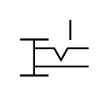

# X10030 Push/pull control

## Definition

```
{
  _style: 'verticalLabelPosition=bottom;aspect=fixed;html=1;verticalAlign=top;fillColor=strokeColor;align=center;outlineConnect=0;shape=mxgraph.fluid_power.x10030;points=[[0,0.35,0],[0,1,0],[0.74,0,0],[1,0.5,0],[1,0.84,0]]',
  _width: 35.24,
  _height: 28.44,
}
```

## Usage

```
import { X10030PushPullControl } from '@reactiac/standard-components-diagrams/fluidPower'

<X10030PushPullControl/>
```

## Preview


