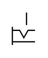

# X10040 Control mechanism

## Definition

```
{
  _style: 'verticalLabelPosition=bottom;aspect=fixed;html=1;verticalAlign=top;fillColor=strokeColor;align=center;outlineConnect=0;shape=mxgraph.fluid_power.x10040;points=[[1,0.6,0]]',
  _width: 18.7,
  _height: 26.36,
}
```

## Usage

```
import { X10040ControlMechanism } from '@diac/standard-components-diagrams/fluidPower'

<X10040ControlMechanism/>
```

## Preview


