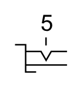

# X10050 Turning control

## Definition

```
{
  _style: { 
    entity: 'verticalLabelPosition=bottom;aspect=fixed;html=1;verticalAlign=top;fillColor=strokeColor;align=center;outlineConnect=0;shape=mxgraph.fluid_power.x10050;points=[[1,0.64,0],[1,0.88,0]]',
  },
  _width: 35.34,
  _height: 39.22,
}
```

## Usage

```
import { X10050TurningControl } from '@diac/standard-components-diagrams/fluidPower'

<X10050TurningControl/>
```

## Preview


