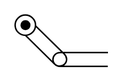

# X10060 Roller lever

## Definition

```
{
  _style: { 
    entity: 'verticalLabelPosition=bottom;aspect=fixed;html=1;verticalAlign=top;fillColor=strokeColor;align=center;outlineConnect=0;shape=mxgraph.fluid_power.x10060;points=[[1,0.72,0],[1,1,0]]',
  },
  _original_width: 62.6,
  _original_height: 35.38,
}
```

## Usage

```
import { X10060RollerLever } from '@dinghy/standard-components-diagrams/fluidPower'

<X10060RollerLever/>
```

## Preview


