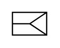

# X10090 Pneumatic spring,

## Definition

```
{
  _style: { 
    entity: 'verticalLabelPosition=bottom;aspect=fixed;html=1;verticalAlign=top;fillColor=strokeColor;align=center;outlineConnect=0;shape=mxgraph.fluid_power.x10090;points=[[0,0,0],[0,0.5,0],[0,1,0],[1,0,0],[1,0.5,0],[1,1,0]]',
  },
  _original_width: 28.08,
  _original_height: 18.7,
}
```

## Usage

```
import { X10090PneumaticSpring } from '@diac/standard-components-diagrams/fluidPower'

<X10090PneumaticSpring/>
```

## Preview


