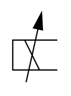

# X10150 Solenoid coil

## Definition

```
{
  _style: { 
    entity: 'verticalLabelPosition=bottom;aspect=fixed;html=1;verticalAlign=top;fillColor=strokeColor;align=center;outlineConnect=0;shape=mxgraph.fluid_power.x10150;points=[[0,0.39,0],[0,0.605,0],[0,0.82,0]]',
  },
  _width: 35.68,
  _height: 55.24,
}
```

## Usage

```
import { X10150SolenoidCoil } from '@diac/standard-components-diagrams/fluidPower'

<X10150SolenoidCoil/>
```

## Preview


