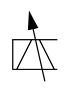

# X10160 Electrical control

## Definition

```
{
  _style: 'verticalLabelPosition=bottom;aspect=fixed;html=1;verticalAlign=top;fillColor=strokeColor;align=center;outlineConnect=0;shape=mxgraph.fluid_power.x10160;points=[[0,0.39,0],[0,0.605,0],[0,0.82,0]]',
  _width: 35.68,
  _height: 55.24,
}
```

## Usage

```
import { X10160ElectricalControl } from '@diac/standard-components-diagrams/fluidPower'

<X10160ElectricalControl/>
```

## Preview


