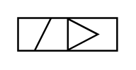

# X10170 Electrically operated

## Definition

```
{
  _style: 'verticalLabelPosition=bottom;aspect=fixed;html=1;verticalAlign=top;fillColor=strokeColor;align=center;outlineConnect=0;shape=mxgraph.fluid_power.x10170;points=[[0,0,0],[0,0.5,0],[0,1,0],[1,0,0],[1,0.5,0],[1,1,0],[0.5,0,0],[0.5,1,0]]',
  _width: 55.94,
  _height: 18.62,
}
```

## Usage

```
import { X10170ElectricallyOperated } from '@reactiac/standard-components-diagrams/fluidPower'

<X10170ElectricallyOperated/>
```

## Preview


