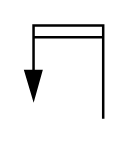

# X10190 Mechanical feedback

## Definition

```
{
  _style: 'verticalLabelPosition=bottom;aspect=fixed;html=1;verticalAlign=top;fillColor=strokeColor;align=center;outlineConnect=0;shape=mxgraph.fluid_power.x10190;points=[[0.1,0.8,0],[0.55,0,0],[1,1,0]]',
  _width: 31.08,
  _height: 37.32,
}
```

## Usage

```
import { X10190MechanicalFeedback } from '@reactiac/standard-components-diagrams/fluidPower'

<X10190MechanicalFeedback/>
```

## Preview


