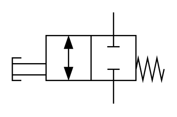

# X10210 2/2 (two-port,

## Definition

```
{
  _style: 'verticalLabelPosition=bottom;aspect=fixed;html=1;verticalAlign=top;fillColor=strokeColor;align=center;outlineConnect=0;shape=mxgraph.fluid_power.x10210;points=[[0.67,0,0],[0.67,1,0],[0,0.62,0],[0.37,0.25,0],[0.37,0.75,0]]',
  _width: 125.54,
  _height: 75.22,
}
```

## Usage

```
import { X1021022TwoPort } from '@diac/standard-components-diagrams/fluidPower'

<X1021022TwoPort/>
```

## Preview


