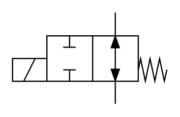

# X10220 2/2 directional

## Definition

```
{
  _style: 'verticalLabelPosition=bottom;aspect=fixed;html=1;verticalAlign=top;fillColor=strokeColor;align=center;outlineConnect=0;shape=mxgraph.fluid_power.x10220;points=[[0.665,0,0],[0.665,1,0],[0,0.62,0],[0.37,0.25,0],[0.37,0.75,0]]',
  _width: 125.54,
  _height: 74.6,
}
```

## Usage

```
import { X1022022Directional } from '@diac/standard-components-diagrams/fluidPower'

<X1022022Directional/>
```

## Preview


