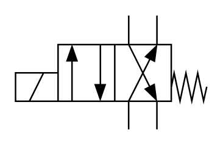

# X10230 4/2 directional

## Definition

```
{
  _style: 'verticalLabelPosition=bottom;aspect=fixed;html=1;verticalAlign=top;fillColor=strokeColor;align=center;outlineConnect=0;shape=mxgraph.fluid_power.x10230;points=[[0.59,0,0],[0.74,0,0],[0.59,1,0],[0.74,1,0],[0,0.5,0],[0,0.625,0],[0,0.75,0],[0.295,0.25,0],[0.295,0.75,0],[0.445,0.25,0],[0.445,0.75,0]]',
  _width: 125.54,
  _height: 74.48,
}
```

## Usage

```
import { X1023042Directional } from '@diac/standard-components-diagrams/fluidPower'

<X1023042Directional/>
```

## Preview


