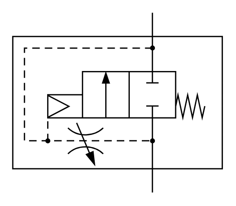

# X10250 Pneumatic slow-start

## Definition

```
{
  _style: { 
    entity: 'verticalLabelPosition=bottom;aspect=fixed;html=1;verticalAlign=top;fillColor=strokeColor;align=center;outlineConnect=0;shape=mxgraph.fluid_power.x10250;points=[[0.665,0,0],[0.665,1,0]]',
  },
  _original_width: 167.26,
  _original_height: 143.78,
}
```

## Usage

```
import { X10250PneumaticSlowStart } from '@diac/standard-components-diagrams/fluidPower'

<X10250PneumaticSlowStart/>
```

## Preview


