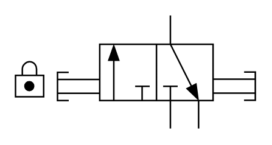

# X10260 3/2 lockout

## Definition

```
{
  _style: 'verticalLabelPosition=bottom;aspect=fixed;html=1;verticalAlign=top;fillColor=strokeColor;align=center;outlineConnect=0;shape=mxgraph.fluid_power.x10260;points=[[0.645,0,0],[0.645,1,0],[0.76,1,0],[0.41,0.25,0],[0.41,0.75,0],[0.53,0.75,0],[1,0.5,0],[1,0.625,0],[1,0.75,0]]',
  _width: 157.64,
  _height: 74.48,
}
```

## Usage

```
import { X1026032Lockout } from '@reactiac/standard-components-diagrams/fluidPower'

<X1026032Lockout/>
```

## Preview


