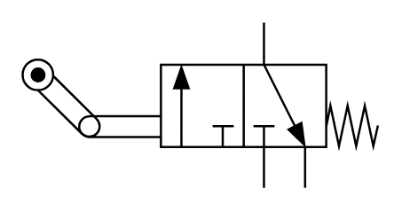

# X10270 3/2 directional

## Definition

```
{
  _style: 'verticalLabelPosition=bottom;aspect=fixed;html=1;verticalAlign=top;fillColor=strokeColor;align=center;outlineConnect=0;shape=mxgraph.fluid_power.x10270;points=[[0.68,0,0],[0.68,1,0],[0.795,1,0],[0.445,0.25,0],[0.445,0.75,0],[0.56,0.75,0]]',
  _width: 160.16,
  _height: 74.48,
}
```

## Usage

```
import { X1027032Directional } from '@diac/standard-components-diagrams/fluidPower'

<X1027032Directional/>
```

## Preview


