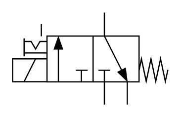

# X10290 3/2 directional

## Definition

```
{
  _style: { 
    entity: 'verticalLabelPosition=bottom;aspect=fixed;html=1;verticalAlign=top;fillColor=strokeColor;align=center;outlineConnect=0;shape=mxgraph.fluid_power.x10290;points=[[0.59,0,0],[0.59,1,0],[0.74,1,0],[0.44,0.75,0],[0.295,0.25,0],[0.295,0.75,0]]',
  },
  _original_width: 125.6,
  _original_height: 74.48,
}
```

## Usage

```
import { X1029032Directional } from '@dinghy/standard-components-diagrams/fluidPower'

<X1029032Directional/>
```

## Preview


