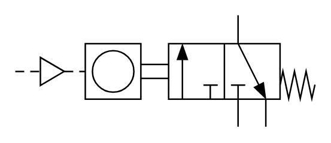

# X10300 Pulse counter

## Definition

```
{
  _style: { 
    entity: 'verticalLabelPosition=bottom;aspect=fixed;html=1;verticalAlign=top;fillColor=strokeColor;align=center;outlineConnect=0;shape=mxgraph.fluid_power.x10300;points=[[0.745,0,0],[0.745,1,0],[0.835,1,0],[0,0.5,0],[0.558,0.25,0],[0.558,0.75,0],[0.65,0.75,0]]',
  },
  _original_width: 200.28,
  _original_height: 74.48,
}
```

## Usage

```
import { X10300PulseCounter } from '@diac/standard-components-diagrams/fluidPower'

<X10300PulseCounter/>
```

## Preview


