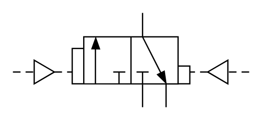

# X10310 3/2 directional

## Definition

```
{
  _style: { 
    entity: 'verticalLabelPosition=bottom;aspect=fixed;html=1;verticalAlign=top;fillColor=strokeColor;align=center;outlineConnect=0;shape=mxgraph.fluid_power.x10310;points=[[0.55,0,0],[0.55,1,0],[0,0.62,0],[1,0.62,0],[0.35,0.25,0],[0.35,0.75,0],[0.45,0.75,0],[0.65,1,0]]',
  },
  _original_width: 186.48,
  _original_height: 74.48,
}
```

## Usage

```
import { X1031032Directional } from '@diac/standard-components-diagrams/fluidPower'

<X1031032Directional/>
```

## Preview


