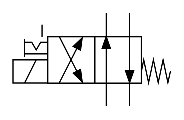

# X10320 4/2 directional

## Definition

```
{
  _style: { 
    entity: 'verticalLabelPosition=bottom;aspect=fixed;html=1;verticalAlign=top;fillColor=strokeColor;align=center;outlineConnect=0;shape=mxgraph.fluid_power.x10320;points=[[0.59,0,0],[0.59,1,0],[0.74,0,0],[0.74,1,0],[0,0.5,0],[0,0.625,0],[0,0.75,0],[0.3,0.25,0],[0.3,0.75,0],[0.44,0.25,0],[0.44,0.75,0]]',
  },
  _width: 125.6,
  _height: 74.48,
}
```

## Usage

```
import { X1032042Directional } from '@diac/standard-components-diagrams/fluidPower'

<X1032042Directional/>
```

## Preview


