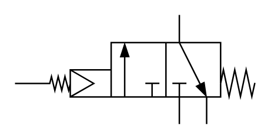

# X10340 3/2 directional

## Definition

```
{
  _style: 'verticalLabelPosition=bottom;aspect=fixed;html=1;verticalAlign=top;fillColor=strokeColor;align=center;outlineConnect=0;shape=mxgraph.fluid_power.x10340;points=[[0.685,0,0],[0.685,1,0],[0.455,0.25,0],[0.455,0.75,0],[0.57,0.75,0],[0.8,1,0],[0,0.625,0]]',
  _width: 163.22,
  _height: 74.48,
}
```

## Usage

```
import { X1034032Directional } from '@reactiac/standard-components-diagrams/fluidPower'

<X1034032Directional/>
```

## Preview


