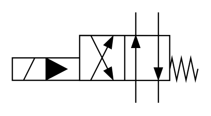

# X10350 4/2 directional

## Definition

```
{
  _style: { 
    entity: 'verticalLabelPosition=bottom;aspect=fixed;html=1;verticalAlign=top;fillColor=strokeColor;align=center;outlineConnect=0;shape=mxgraph.fluid_power.x10350;points=[[0.665,0,0],[0.665,1,0],[0.785,0,0],[0.785,1,0],[0,0.5,0],[0,0.625,0],[0,0.75,0],[0.42,0.25,0],[0.42,0.75,0],[0.545,0.25,0],[0.545,0.75,0]]',
  },
  _original_width: 153.38,
  _original_height: 74.48,
}
```

## Usage

```
import { X1035042Directional } from '@diac/standard-components-diagrams/fluidPower'

<X1035042Directional/>
```

## Preview


