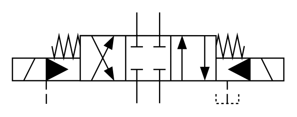

# X10360 4/3 directional

## Definition

```
{
  _style: { 
    entity: 'verticalLabelPosition=bottom;aspect=fixed;html=1;verticalAlign=top;fillColor=strokeColor;align=center;outlineConnect=0;shape=mxgraph.fluid_power.x10360;points=[[0.46,0,0],[0.46,1,0],[0.54,0,0],[0.54,1,0],[0,0.5,0],[0,0.625,0],[0,0.75,0],[0.29,0.25,0],[0.29,0.75,0],[0.375,0.25,0],[0.375,0.75,0],[1,0.5,0],[1,0.625,0],[1,0.75,0],[0.625,0.25,0],[0.625,0.75,0],[0.71,0.25,0],[0.71,0.75,0],[0.125,1,0],[0.79,1,0]]',
  },
  _original_width: 222.6,
  _original_height: 75.02,
}
```

## Usage

```
import { X1036043Directional } from '@dinghy/standard-components-diagrams/fluidPower'

<X1036043Directional/>
```

## Preview


