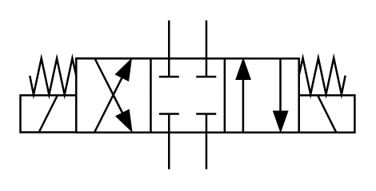

# X10370 4/3 directional

## Definition

```
{
  _style: 'verticalLabelPosition=bottom;aspect=fixed;html=1;verticalAlign=top;fillColor=strokeColor;align=center;outlineConnect=0;shape=mxgraph.fluid_power.x10370;points=[[0.445,0,0],[0.445,1,0],[0.555,0,0],[0.555,1,0],[0,0.5,0],[0,0.625,0],[0,0.75,0],[1,0.5,0],[1,0.625,0],[1,0.75,0],[0.222,0.25,0],[0.222,0.75,0],[0.335,0.25,0],[0.335,0.75,0],[0.665,0.25,0],[0.665,0.75,0],[0.777,0.25,0],[0.777,0.75,0]]',
  _width: 167.16,
  _height: 74.48,
}
```

## Usage

```
import { X1037043Directional } from '@reactiac/standard-components-diagrams/fluidPower'

<X1037043Directional/>
```

## Preview


