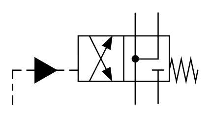

# X10380 4/2 directional

## Definition

```
{
  _style: { 
    entity: 'verticalLabelPosition=bottom;aspect=fixed;html=1;verticalAlign=top;fillColor=strokeColor;align=center;outlineConnect=0;shape=mxgraph.fluid_power.x10380;points=[[0.66,0,0],[0.66,1,0],[0.785,0,0],[0.785,1,0],[0,1,0],[0.415,0.25,0],[0.415,0.75,0],[0.54,0.25,0],[0.54,0.75,0]]',
  },
  _original_width: 150.74,
  _original_height: 75.06,
}
```

## Usage

```
import { X1038042Directional } from '@dinghy/standard-components-diagrams/fluidPower'

<X1038042Directional/>
```

## Preview


