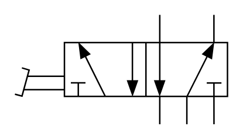

# X10400 5/2 directional

## Definition

```
{
  _style: { 
    entity: 'verticalLabelPosition=bottom;aspect=fixed;html=1;verticalAlign=top;fillColor=strokeColor;align=center;outlineConnect=0;shape=mxgraph.fluid_power.x10400;points=[[0.68,0,0],[0.68,1,0],[0.938,0,0],[0.938,1,0],[0.81,1,0],[0.3,0.25,0],[0.425,0.75,0],[0.553,0.25,0],[0.553,0.75,0],[0.3,0.75,0]]',
  },
  _original_width: 145.2,
  _original_height: 75.02,
}
```

## Usage

```
import { X1040052Directional } from '@dinghy/standard-components-diagrams/fluidPower'

<X1040052Directional/>
```

## Preview


