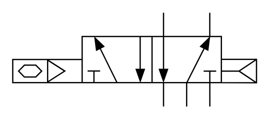

# X10410 5/2 pneumatic

## Definition

```
{
  _style: 'verticalLabelPosition=bottom;aspect=fixed;html=1;verticalAlign=top;fillColor=strokeColor;align=center;outlineConnect=0;shape=mxgraph.fluid_power.x10410;points=[[0.62,0,0],[0.62,1,0],[0.808,0,0],[0.808,1,0],[0.713,1,0],[0.335,0.25,0],[0.333,0.75,0],[0.427,0.75,0],[0.522,0.25,0],[0.522,0.75,0],[0,0.5,0],[0,0.625,0],[0,0.75,0],[1,0.5,0],[1,0.625,0],[1,0.75,0]]',
  _width: 195,
  _height: 75.02,
}
```

## Usage

```
import { X1041052Pneumatic } from '@diac/standard-components-diagrams/fluidPower'

<X1041052Pneumatic/>
```

## Preview


