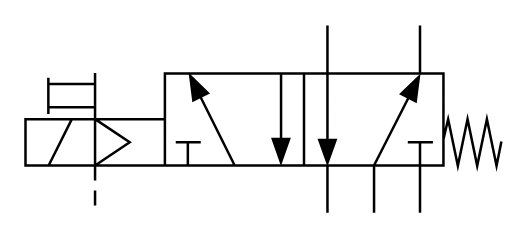

# X10430 5/2 pneumatic

## Definition

```
{
  _style: 'verticalLabelPosition=bottom;aspect=fixed;html=1;verticalAlign=top;fillColor=strokeColor;align=center;outlineConnect=0;shape=mxgraph.fluid_power.x10430;points=[[0.634,0,0],[0.634,1,0],[0.83,0,0],[0.732,1,0],[0.83,1,0],[0.343,0.25,0],[0.341,0.75,0],[0.537,0.25,0],[0.537,0.75,0],[0.44,0.75,0],[0.145,1,0],[0,0.5,0],[0,0.625,0],[0,0.75,0]]',
  _width: 190.36,
  _height: 74.94,
}
```

## Usage

```
import { X1043052Pneumatic } from '@reactiac/standard-components-diagrams/fluidPower'

<X1043052Pneumatic/>
```

## Preview


