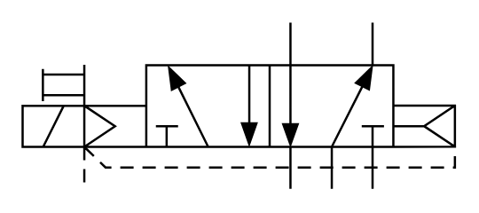

# X10441 5/2 pneumatic

## Definition

```
{
  _style: { 
    entity: 'verticalLabelPosition=bottom;aspect=fixed;html=1;verticalAlign=top;fillColor=strokeColor;align=center;outlineConnect=0;shape=mxgraph.fluid_power.x10441;points=[[0.62,0,0],[0.62,1,0],[0.81,0,0],[0.81,1,0],[0.715,1,0],[0.337,0.25,0],[0.335,0.75,0],[0.525,0.25,0],[0.525,0.75,0],[0.43,0.75,0],[0.145,1,0],[0,0.5,0],[0,0.625,0],[0,0.75,0],[1,0.5,0],[1,0.625,0],[1,0.75,0]]',
  },
  _original_width: 194.94,
  _original_height: 74.94,
}
```

## Usage

```
import { X1044152Pneumatic } from '@diac/standard-components-diagrams/fluidPower'

<X1044152Pneumatic/>
```

## Preview


