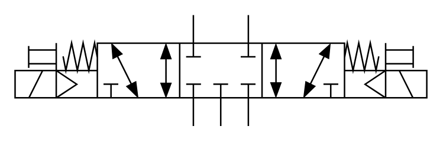

# X10450 5/3 pneumatic

## Definition

```
{
  _style: { 
    entity: 'verticalLabelPosition=bottom;aspect=fixed;html=1;verticalAlign=top;fillColor=strokeColor;align=center;outlineConnect=0;shape=mxgraph.fluid_power.x10450;points=[[0.433,0,0],[0.433,1,0],[0.5,1,0],[0.567,0,0],[0.567,1,0],[0.233,0.25,0],[0.233,0.75,0],[0.298,0.75,0],[0.365,0.25,0],[0.365,0.75,0],[0.632,0.25,0],[0.632,0.75,0],[0.764,0.25,0],[0.7,0.75,0],[0.767,0.75,0],[0,0.5,0],[0,0.625,0],[0,0.75,0],[1,0.5,0],[1,0.625,0],[1,0.75,0]]',
  },
  _width: 278.44,
  _height: 75.04,
}
```

## Usage

```
import { X1045053Pneumatic } from '@diac/standard-components-diagrams/fluidPower'

<X1045053Pneumatic/>
```

## Preview


