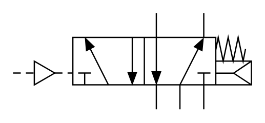

# X10460 Directly operated

## Definition

```
{
  _style: 'verticalLabelPosition=bottom;aspect=fixed;html=1;verticalAlign=top;fillColor=strokeColor;align=center;outlineConnect=0;shape=mxgraph.fluid_power.x10460;points=[[0.6,0,0],[0.6,1,0],[0.8,0,0],[0.8,1,0],[0.7,1,0],[0.3,0.25,0],[0.3,0.75,0],[0.4,0.75,0],[0.5,0.25,0],[0.5,0.75,0],[0,0.625,0],[1,0.5,0],[1,0.625,0],[1,0.75,0]]',
  _width: 186,
  _height: 75.08,
}
```

## Usage

```
import { X10460DirectlyOperated } from '@reactiac/standard-components-diagrams/fluidPower'

<X10460DirectlyOperated/>
```

## Preview


