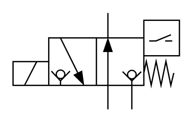

# X10480 3/2 solenoid-actuated

## Definition

```
{
  _style: 'verticalLabelPosition=bottom;aspect=fixed;html=1;verticalAlign=top;fillColor=strokeColor;align=center;outlineConnect=0;shape=mxgraph.fluid_power.x10480;points=[[0.57,0,0],[0.57,1,0],[0.283,0.255,0],[0.425,0.75,0],[0.283,0.75,0],[0.712,1,0],[0,0.5,0],[0,0.625,0],[0,0.75,0]]',
  _width: 130,
  _height: 75.54,
}
```

## Usage

```
import { X1048032SolenoidActuated } from '@diac/standard-components-diagrams/fluidPower'

<X1048032SolenoidActuated/>
```

## Preview


