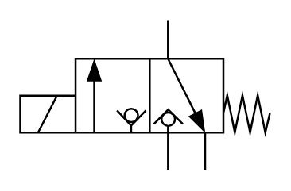

# X10490 3/2 solenoid-actuated

## Definition

```
{
  _style: { 
    entity: 'verticalLabelPosition=bottom;aspect=fixed;html=1;verticalAlign=top;fillColor=strokeColor;align=center;outlineConnect=0;shape=mxgraph.fluid_power.x10490;points=[[0.59,0,0],[0.59,1,0],[0.297,0.255,0],[0.442,0.75,0],[0.297,0.75,0],[0.74,1,0],[0,0.5,0],[0,0.625,0],[0,0.75,0]]',
  },
  _original_width: 125.58,
  _original_height: 75.54,
}
```

## Usage

```
import { X1049032SolenoidActuated } from '@dinghy/standard-components-diagrams/fluidPower'

<X1049032SolenoidActuated/>
```

## Preview


