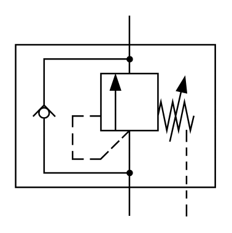

# X10520 Sequence valve,

## Definition

```
{
  _style: 'verticalLabelPosition=bottom;aspect=fixed;html=1;verticalAlign=top;fillColor=strokeColor;align=center;outlineConnect=0;shape=mxgraph.fluid_power.x10520;points=[[0.57,0,0],[0.57,1,0],[0.856,1,0]]',
  _width: 130.08,
  _height: 131.02,
}
```

## Usage

```
import { X10520SequenceValve } from '@reactiac/standard-components-diagrams/fluidPower'

<X10520SequenceValve/>
```

## Preview


