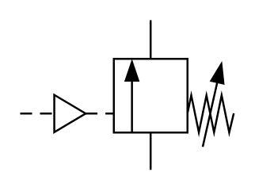

# X10530 Sequence valve,

## Definition

```
{
  _style: 'verticalLabelPosition=bottom;aspect=fixed;html=1;verticalAlign=top;fillColor=strokeColor;align=center;outlineConnect=0;shape=mxgraph.fluid_power.x10530;points=[[0.61,0,0],[0.61,1,0],[0,0.62,0]]',
  _width: 107.88,
  _height: 75.54,
}
```

## Usage

```
import { X10530SequenceValve } from '@reactiac/standard-components-diagrams/fluidPower'

<X10530SequenceValve/>
```

## Preview


