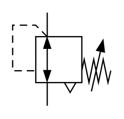

# X10540 Pressure regulator,

## Definition

```
{
  _style: 'verticalLabelPosition=bottom;aspect=fixed;html=1;verticalAlign=top;fillColor=strokeColor;align=center;outlineConnect=0;shape=mxgraph.fluid_power.x10540;points=[[0.35,0,0],[0.35,1,0]]',
  _width: 79.18,
  _height: 75.54,
}
```

## Usage

```
import { X10540PressureRegulator } from '@reactiac/standard-components-diagrams/fluidPower'

<X10540PressureRegulator/>
```

## Preview


