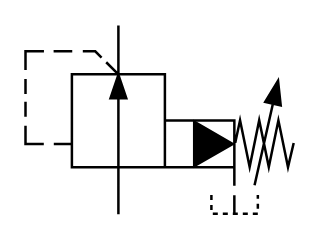

# X10560 Pitot-operated two-port

## Definition

```
{
  _style: 'verticalLabelPosition=bottom;aspect=fixed;html=1;verticalAlign=top;fillColor=strokeColor;align=center;outlineConnect=0;shape=mxgraph.fluid_power.x10560;points=[[0.348,0,0],[0.348,1,0],[0.778,1,0]]',
  _width: 107.28,
  _height: 75.54,
}
```

## Usage

```
import { X10560PitotOperatedTwoPort } from '@diac/standard-components-diagrams/fluidPower'

<X10560PitotOperatedTwoPort/>
```

## Preview


