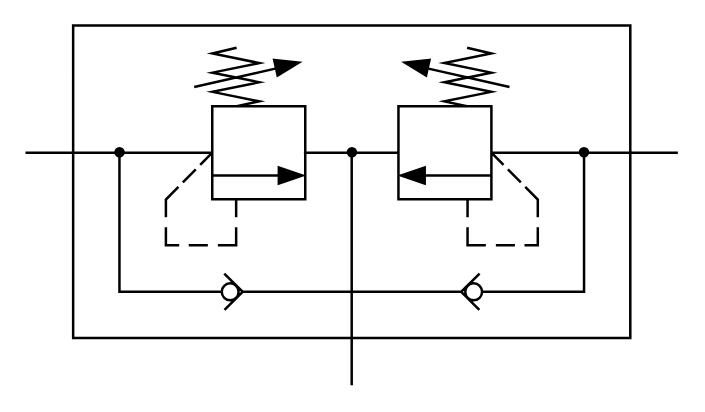

# X10580  Pressure-relief

## Definition

```
{
  _style: 'verticalLabelPosition=bottom;aspect=fixed;html=1;verticalAlign=top;fillColor=strokeColor;align=center;outlineConnect=0;shape=mxgraph.fluid_power.x10580;points=[[0,0.355,0],[1,0.355,0],[0.5,1,0]]',
  _width: 260.94,
  _height: 143.86,
}
```

## Usage

```
import { X10580PressureRelief } from '@diac/standard-components-diagrams/fluidPower'

<X10580PressureRelief/>
```

## Preview


