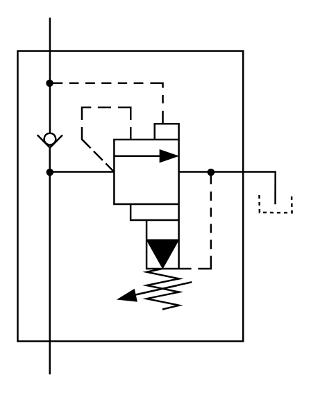

# X10590 Accumulator-charging valve

## Definition

```
{
  _style: 'verticalLabelPosition=bottom;aspect=fixed;html=1;verticalAlign=top;fillColor=strokeColor;align=center;outlineConnect=0;shape=mxgraph.fluid_power.x10590;points=[[0.117,0,0],[0.117,1,0],[0.94,0.545,0]]',
  _width: 158.02,
  _height: 205.46,
}
```

## Usage

```
import { X10590AccumulatorChargingValve } from '@diac/standard-components-diagrams/fluidPower'

<X10590AccumulatorChargingValve/>
```

## Preview


