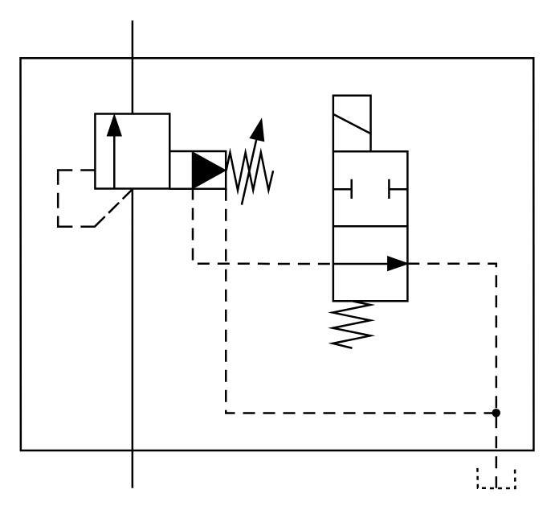

# X10600 Hydraulic pilot-controlled

## Definition

```
{
  _style: { 
    entity: 'verticalLabelPosition=bottom;aspect=fixed;html=1;verticalAlign=top;fillColor=strokeColor;align=center;outlineConnect=0;shape=mxgraph.fluid_power.x10600;points=[[0.218,0,0],[0.218,1,0],[0.927,1,0]]',
  },
  _width: 255.58,
  _height: 232.62,
}
```

## Usage

```
import { X10600HydraulicPilotControlled } from '@diac/standard-components-diagrams/fluidPower'

<X10600HydraulicPilotControlled/>
```

## Preview


