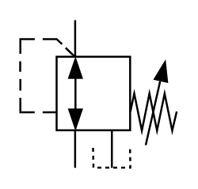

# X10610 Three-port pressure-reducing

## Definition

```
{
  _style: { 
    entity: 'verticalLabelPosition=bottom;aspect=fixed;html=1;verticalAlign=top;fillColor=strokeColor;align=center;outlineConnect=0;shape=mxgraph.fluid_power.x10610;points=[[0.35,0,0],[0.35,1,0],[0.585,1,0]]',
  },
  _original_width: 79.06,
  _original_height: 74.7,
}
```

## Usage

```
import { X10610ThreePortPressureReducing } from '@diac/standard-components-diagrams/fluidPower'

<X10610ThreePortPressureReducing/>
```

## Preview


