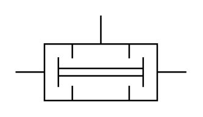

# X10620 Dual pressure

## Definition

```
{
  _style: { 
    entity: 'verticalLabelPosition=bottom;aspect=fixed;html=1;verticalAlign=top;fillColor=strokeColor;align=center;outlineConnect=0;shape=mxgraph.fluid_power.x10620;points=[[0.5,0,0],[0,0.66,0],[1,0.66,0]]',
  },
  _width: 112.1,
  _height: 55.84,
}
```

## Usage

```
import { X10620DualPressure } from '@diac/standard-components-diagrams/fluidPower'

<X10620DualPressure/>
```

## Preview


