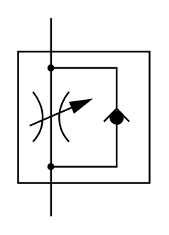

# X10640 Flow-control valve,

## Definition

```
{
  _style: 'verticalLabelPosition=bottom;aspect=fixed;html=1;verticalAlign=top;fillColor=strokeColor;align=center;outlineConnect=0;shape=mxgraph.fluid_power.x10640;points=[[0.25,0,0],[0.25,1,0]]',
  _width: 74.06,
  _height: 111.96,
}
```

## Usage

```
import { X10640FlowControlValve } from '@reactiac/standard-components-diagrams/fluidPower'

<X10640FlowControlValve/>
```

## Preview


