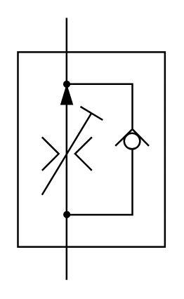

# X10660 Two-port flow-control

## Definition

```
{
  _style: { 
    entity: 'verticalLabelPosition=bottom;aspect=fixed;html=1;verticalAlign=top;fillColor=strokeColor;align=center;outlineConnect=0;shape=mxgraph.fluid_power.x10660;points=[[0.33,0,0],[0.33,1,0]]',
  },
  _original_width: 83.74,
  _original_height: 149.34,
}
```

## Usage

```
import { X10660TwoPortFlowControl } from '@dinghy/standard-components-diagrams/fluidPower'

<X10660TwoPortFlowControl/>
```

## Preview


